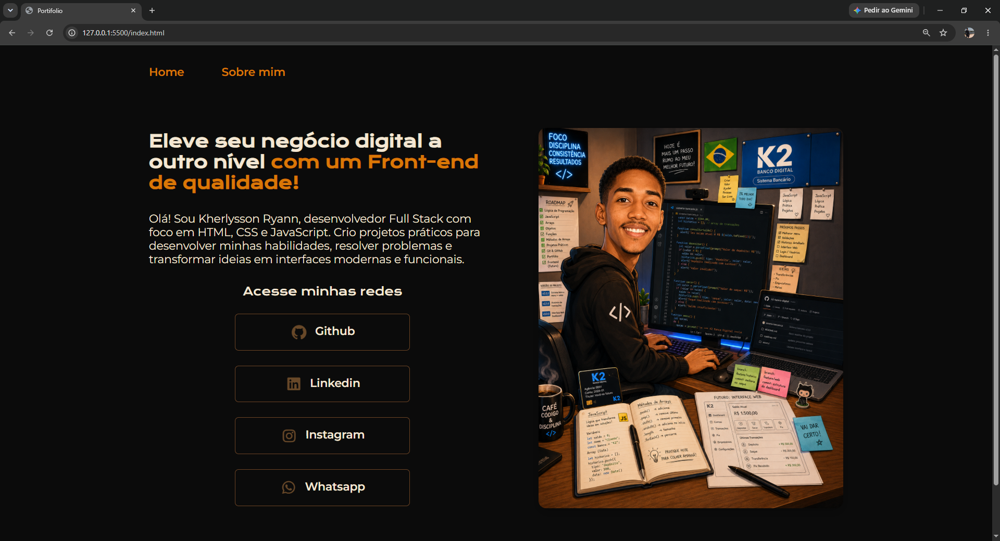

# Portfólio Alura — Kherlysson Ryann

## Sobre o projeto

Este projeto é o meu portfólio pessoal, desenvolvido para apresentar minha trajetória de aprendizado, meus projetos e as formas de entrar em contato comigo.

A interface possui um visual escuro com detalhes em tons de cobre e bege, criando uma identidade moderna e alinhada ao universo de tecnologia e desenvolvimento.

> Projeto em desenvolvimento e atualizado conforme avanço nos estudos.

## Funcionalidades

- Página inicial com apresentação profissional;
- Seção **Sobre mim**;
- Links para GitHub, LinkedIn, Instagram e WhatsApp;
- Layout organizado em duas colunas;
- Imagens personalizadas para representar minha jornada na programação;
- Estilização com variáveis CSS;
- Estrutura preparada para receber novos projetos e melhorias.

## Tecnologias utilizadas

- **HTML5** — estrutura e conteúdo das páginas;
- **CSS3** — estilização, organização do layout e responsividade;
- **Google Fonts** — tipografia do projeto;
- **Git e GitHub** — versionamento e armazenamento do código;
- **Visual Studio Code** — ambiente de desenvolvimento.

## Objetivo

O principal objetivo deste portfólio é reunir meus projetos em um único lugar e acompanhar minha evolução como desenvolvedor.

Além de funcionar como apresentação profissional, o projeto também é uma forma de praticar:

- HTML semântico;
- Organização de classes CSS;
- Flexbox;
- Responsividade;
- Uso de variáveis CSS;
- Boas práticas de estruturação de páginas;
- Versionamento com Git.

## Aprendizados

Durante o desenvolvimento deste projeto, pratiquei a criação de páginas com HTML e CSS, a organização visual dos elementos, a construção de componentes reutilizáveis e a aplicação de uma identidade visual própria.

## Autor

Desenvolvido por **Kherlysson Ryann**.

Conecte-se comigo pelos links disponíveis no próprio portfólio.
